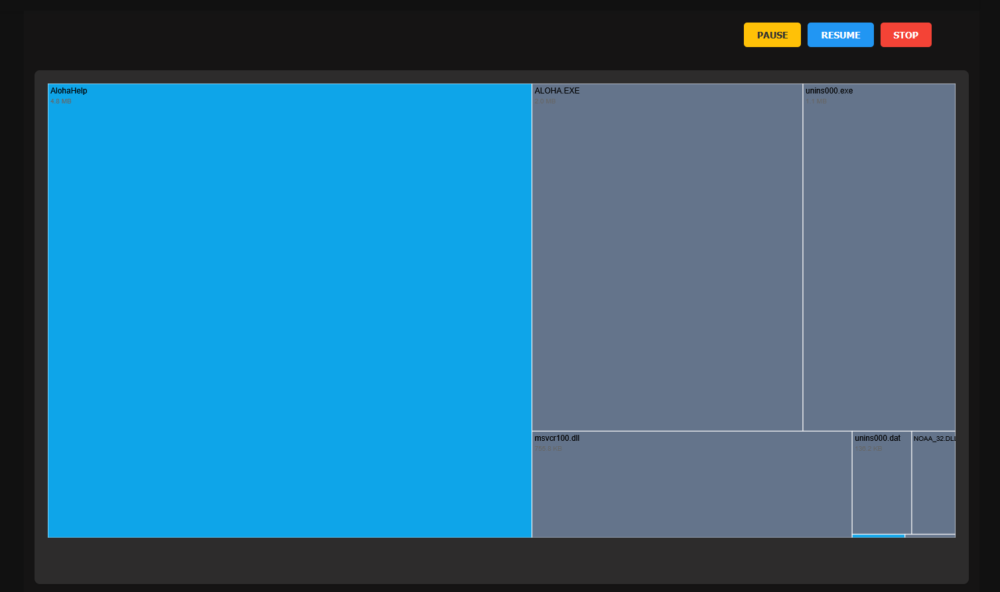
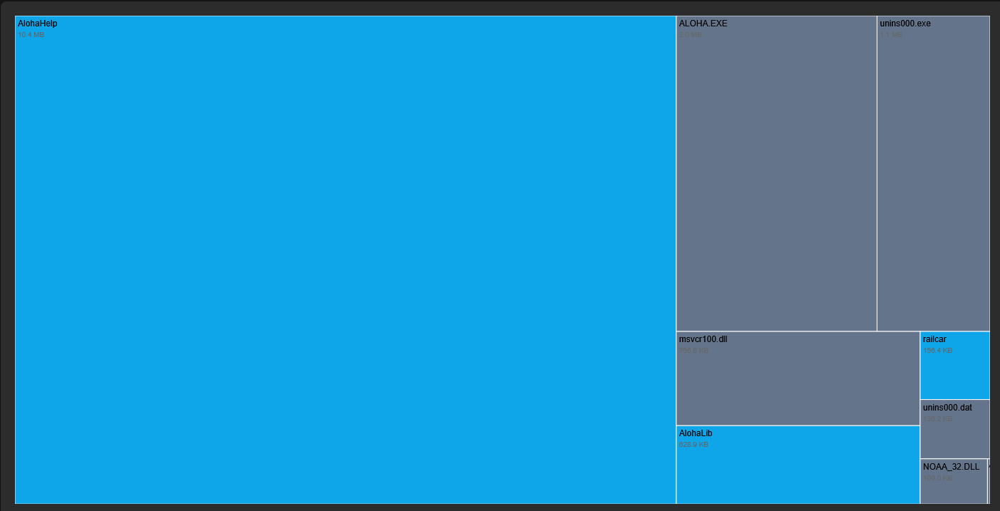
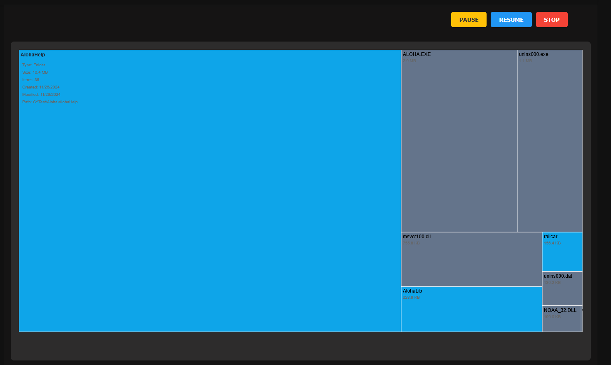
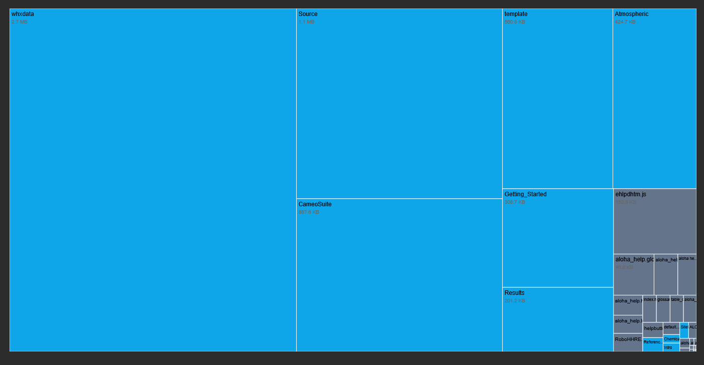

# File Wizard

<p align="center">
    
</p>

*A Scalable File Management Application*

## Overview

File Wizard is a desktop utility designed to simplify file system management through an intuitive user interface and powerful backend services. Built with modern web technologies and Rust, it is designed to be modular, scalable, and efficient.

**Note:** This project is currently in progress. We are actively working on adding new features and improvements.

### Planned Features

- **Advanced Heuristics for File System Discovery:** Implement a more robust heuristic for frontier node traversal to optimize file system exploration.
- **File Deletion:** Enable users to delete files directly from the application, enhancing file management capabilities.
- **Settings Page:** Provide customizable settings to allow users to configure the application according to their preferences.
- **File Details Page:** Introduce a dedicated page for viewing detailed information about discovered files, including metadata and content previews.

## Features

- **File Organization:** Simplify file and folder management with intuitive drag-and-drop functionality.
- **Search Operations:** Utilize advanced search capabilities with robust threading for fast results.
- **Metadata Management:** Efficiently handle and display file metadata, including size, type, and timestamps.
- **Cross-Platform Desktop App:** Built with Electron, ensuring seamless integration across Windows, macOS, and Linux.

## Screenshots

Experience the intuitive interface and powerful features of File Wizard through the following screenshots:

### 1. Initiating a Search


*Figure 1: Users can enter or drag and drop a directory path to begin a file system search.*

### 3. Dynamic Visualization



*Figure 3: Real-time visualization of the file system as the search progresses.*



*Figure 4: The seach progressing.*

### 4. Viewing Metadata



*Figure 5: Hovering over files or folders reveals detailed metadata information.*

### 5. Navigating Directories



*Figure 5: Navigate through directories by clicking on folders within the visualization.*

## Technology Stack

### Frontend

- **Language:** JavaScript (ES6+)
- **Libraries:** React, Electron, D3.js, React Router Dom
- **State Management:** React Hooks (`useState`, `useEffect`)
- **Build Tools:** Webpack, npm
- **Styling:** CSS

### Backend

- **Language:** Rust
- **Concurrency:** `std::thread`, `Arc`, `Mutex`
- **Libraries:** Actix Web (HTTP server and routing), Serde (JSON serialization/deserialization)

### Communication

- **Protocol:** HTTP (RESTful API)
- **Data Format:** JSON

## Architecture Overview

File Wizard uses a layered architecture:

1. **Frontend (React + Electron):** Handles UI and user interaction.
2. **HTTP Routers:** Processes frontend requests.
3. **Controllers:** Delegates requests to backend services.
4. **Backend Services:** Executes core application logic.


## Documentation

For detailed information about the architecture, design, and implementation, refer to the [File Wizard Documentation](File_Wizard_Documentation.pdf).

## Prerequisites

- **Node.js and npm:** Install from [nodejs.org](https://nodejs.org/).
- **Rust:** Install using [rustup](https://www.rust-lang.org/tools/install).

## Getting Started

**Note**: There will be an installer built for users to run the program and install in their file system at a later build release.

1. Clone the repository:  

   ```bash
   git clone https://github.com/GabrielPerezCSDev/FileWizard.git
   cd FileWizard

2. Install dependencies for the frontend:

    ```bash
    Copy code
    npm install
3. Run the application in development mode:

    ```bash
    npm run dev
    ```

    - This starts both the backend (using Rust) and the frontend (React + Electron) concurrently.
4. Build the application for production:

    ```bash
    npm run build
    ```

    - This builds the frontend (React + Electron) and compiles the Rust backend in release mode.  

## License

This project is licensed under the [MIT License](./LICENSE).  
You are free to use, modify, and distribute this software, provided proper attribution is given to the original author.