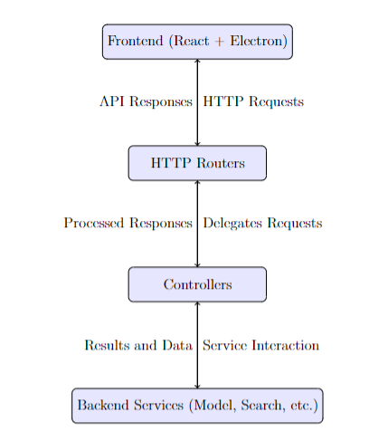

# File Wizard

<p align="center">
    
</p>

*A Scalable File Management Application*

## Overview
File Wizard is a desktop utility designed to simplify file system management through an intuitive user interface and powerful backend services. Built with modern web technologies and Rust, it is highly modular, scalable, and efficient.

## Features
- **File Organization:** Simplify file and folder management.
- **Search Operations:** Advanced search capabilities with robust threading.
- **Metadata Management:** Efficiently handles and displays file metadata.
- **Cross-Platform Desktop App:** Built with Electron for seamless desktop integration.

## Technology Stack
### Frontend
- **Languages:** JavaScript, TypeScript
- **Libraries:** React, Electron
- **Build Tools:** Webpack, npm

### Backend
- **Language:** Rust
- **Concurrency:** `std::thread`, `Arc`, `Mutex`

### Communication
- **Protocol:** HTTP
- **Libraries:** Actix Web, Serde (JSON)

## Architecture Overview
File Wizard uses a layered architecture:
1. **Frontend (React + Electron):** Handles UI and user interaction.
2. **HTTP Routers:** Processes frontend requests.
3. **Controllers:** Delegates requests to backend services.
4. **Backend Services:** Executes core application logic.



## Documentation
For detailed information about the architecture, design, and implementation, refer to the [File Wizard Documentation](File_Wizard_Documentation.pdf).

## Getting Started
1. Clone the repository:  
   ```bash
   git clone https://github.com/username/FileWizard.git
   cd FileWizard

2. Install dependencies for the frontend:
    ```bash
    Copy code
    npm install
3. Run the application in development mode:
    ```bash
    npm run dev
    ```
    - This starts both the backend (using Rust) and the frontend (React + Electron) concurrently.
4. Build the application for production:
    ```bash
    npm run build
    ```
    - This builds the frontend (React + Electron) and compiles the Rust backend in release mode.
  
## Contributing
Contributions are welcome! If you'd like to contribute, follow these steps:
1. Fork the repository.
2. Create a new branch for your feature or bug fix:  
   ```bash
   git checkout -b your-feature-branch
   ```
3. Make your changes and commit them with a descriptive message:
    ```bash 
    git commit -m "Add description of your changes"
    ```
4. Push your changes to your fork:
   ```bash
   git push origin your-feature-branch
    ```
5. Open a pull request to the main branch of this repository and provide a detailed description of your changes.

## License
This project is licensed under the [MIT License](./assets/LICENSE).  
You are free to use, modify, and distribute this software, provided proper attribution is given to the original author.